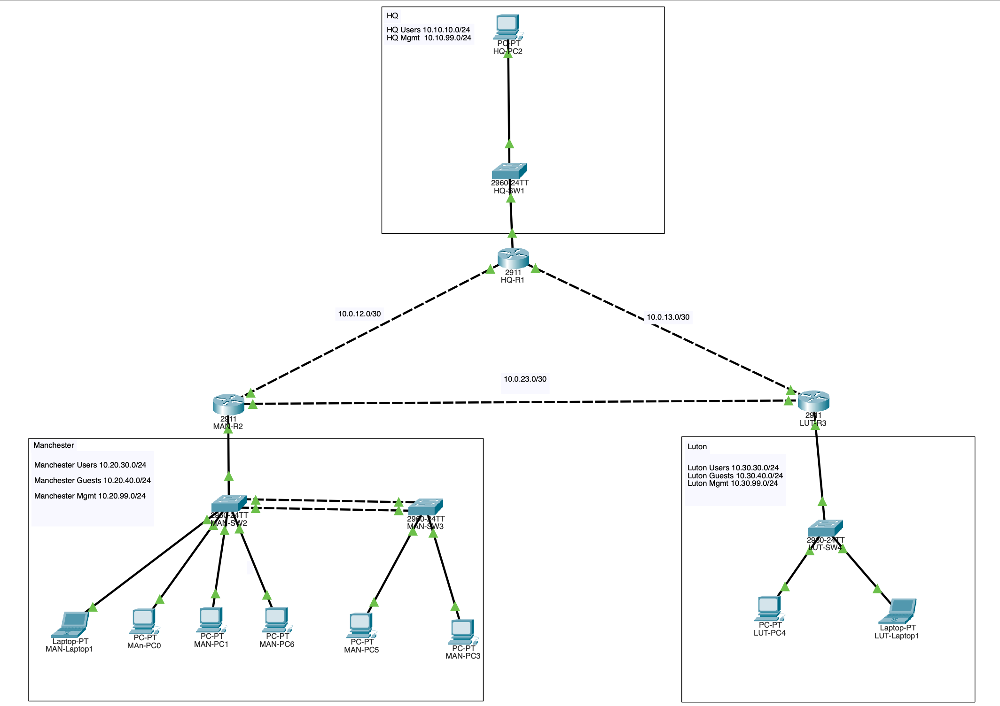

# Multi-Site Enterprise Network Lab  
**OSPF + VLANs + ACLs + Port Security + Guest Isolation**

Cisco Packet Tracer lab demonstrating a realistic multi-site enterprise network with inter-site routing, security segmentation, and access control.

---

## Overview

This lab simulates a three-site enterprise network (HQ + Manchester + Luton) with:

- Multi-VLAN design (Users, Guests, Management)
- OSPF Area 0 routing between sites
- Router-on-a-Stick / subinterfaces
- DHCP services
- Guest network isolation using extended ACLs
- Port security with sticky MAC addresses
- Dynamic ARP Inspection (DAI) on selected switches

The design focuses on **practical security controls** and **troubleshooting-ready documentation**.

---

## Network Topology

**Sites:**
- HQ (R1)
- Manchester (R2)
- Luton (R3)

---

## Addressing Scheme

| Site / VLAN       | Network          | Gateway       | Purpose          |
|-------------------|------------------|---------------|------------------|
| HQ Users          | 10.10.10.0/24    | 10.10.10.1    | Corporate users  |
| HQ Mgmt           | 10.10.99.0/24    | 10.10.99.1    | Management       |
| Manchester Users  | 10.20.30.0/24    | 10.20.30.1    | Corporate users  |
| Manchester Guests | 10.20.40.0/24    | 10.20.40.1    | Guest isolation  |
| Manchester Mgmt   | 10.20.99.0/24    | 10.20.99.1    | Management       |
| Luton Users       | 10.30.30.0/24    | 10.30.30.1    | Corporate users  |
| Luton Guests      | 10.30.40.0/24    | 10.30.40.1    | Guest isolation  |
| Point-to-point    | 10.0.12.0/30     | —             | R1 ↔ R2          |
| Point-to-point    | 10.0.23.0/30     | —             | R2 ↔ R3          |
| Point-to-point    | 10.0.13.0/30     | —             | R1 ↔ R3          |
---

## Technologies Used

- Cisco IOS
- VLANs + 802.1Q trunking
- Router-on-a-Stick (subinterfaces)
- OSPF (single area)
- DHCP
- Extended ACLs (inbound + outbound)
- Port Security (sticky MAC)
- Dynamic ARP Inspection (DAI)

---

## Key Security Features

### Guest Isolation
- Guests can only communicate with other guests and their local gateway
- Guests are blocked from all internal corporate networks
- Internal users can reach the Guest gateway (for troubleshooting) but not Guest PCs

### Port Security
- Sticky MAC learning on access ports
- Violation mode: shutdown (or restrict)
- Zero security violations after correct configuration

---

## Verification Summary

| Test                              | Result |
|-----------------------------------|--------|
| Inter-site PC-to-PC connectivity  | ✅     |
| OSPF adjacencies (FULL)           | ✅     |
| Guest → Internal blocked          | ✅     |
| Internal → Guest PC blocked       | ✅     |
| Internal → Guest gateway allowed  | ✅     |
| Port security sticky MACs         | ✅     |
| ACL hit counters                  | ✅     |
| Dynamic ARP Inspection (DAI)      | ✅     |

Detailed verification outputs are in the [verification/](/verification) folder.

---

## How to Use

1. Open [lab](packet-tracer/enterprise-network.pkt) in Cisco Packet Tracer
2. Load the configurations from the [config](/config) folder if needed
3. PCs obtain addresses via DHCP
4. Test connectivity and security policies as documented

---

## Lessons Learned

- ACL order is critical — more specific permits must come before broader denies
- Guest isolation is most effective when applied in both directions
- Sticky MAC addresses must be saved to startup-config to survive reloads
- Documenting both successful and blocked traffic makes the lab much stronger for a portfolio

---

## Future Improvements

- Add IPv6
- Replace Router-on-a-Stick with Layer 3 switching
- Implement OSPF authentication
- Add a simple Python script for config backup
- Introduce a basic monitoring / logging component

---

## Author

Willian De Sousa – Network+ | Security+ | Building practical networking labs
